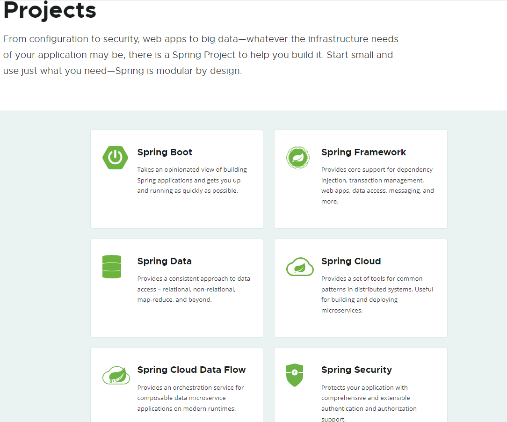
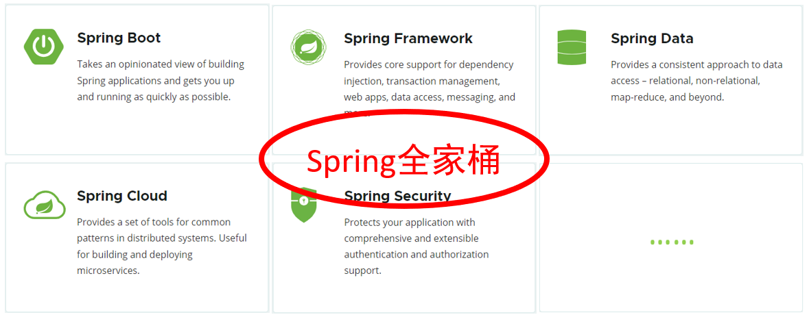
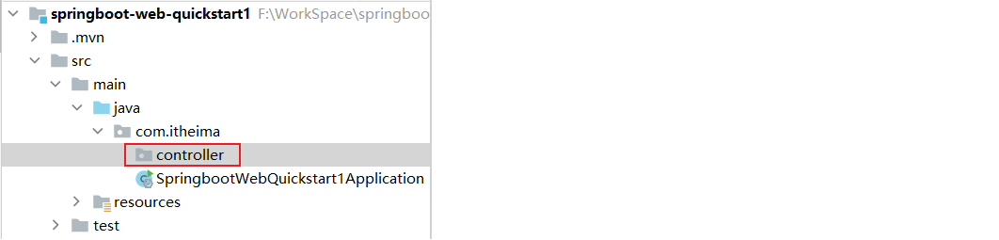
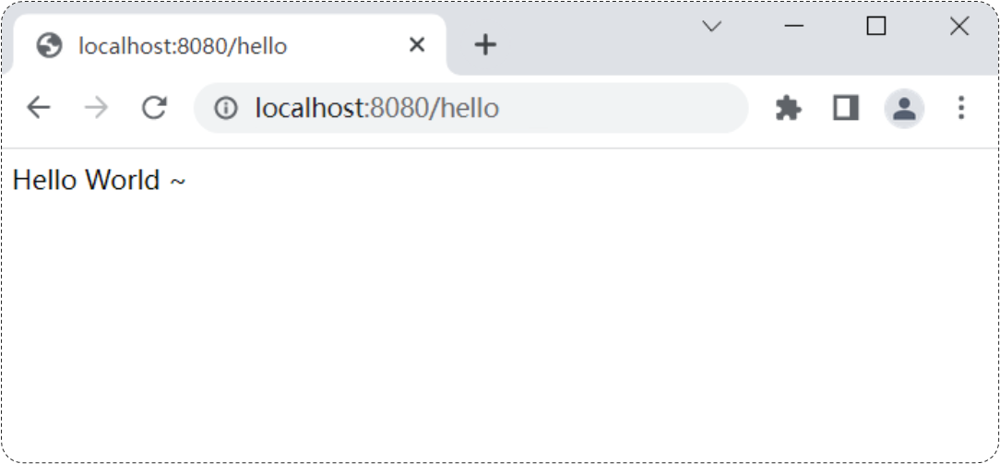
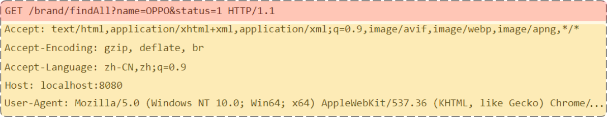
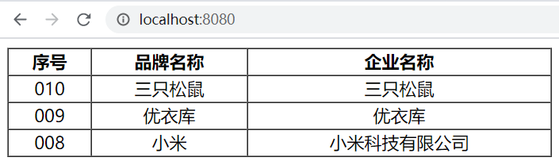

# SpringBoot基础 

## 课程内容

> 1. SpringBootWeb入门
>
> 2. HTTP协议
>
> 3. Web服务器-Tomcat


## 前言


下面我们将进入SpringBoot基础阶段的学习。

在没有正式的学习SpringBoot之前，我们要先来了解下什么是Spring。

我们可以打开Spring的官网(https://spring.io)，去看一下Spring的简介：Spring makes Java simple。


Spring的官方提供很多开源的项目，我们可以点击上面的projects，看到spring家族旗下的项目，按照流行程度排序为：




Spring发展到今天已经形成了一种开发生态圈，Spring提供了若干个子项目，每个项目用于完成特定的功能。而我们在项目开发时，一般会偏向于选择这一套spring家族的技术，来解决对应领域的问题，那我们称这一套技术为**spring全家桶**。




而Spring家族旗下这么多的技术，最基础、最核心的是 SpringFramework。其他的spring家族的技术，都是基于SpringFramework的，SpringFramework中提供很多实用功能，如：依赖注入、事务管理、web开发支持、数据访问、消息服务等等。


而如果我们在项目中，直接基于SpringFramework进行开发，存在两个问题：配置繁琐、入门难度大。 


所以基于此呢，spring官方推荐我们从另外一个项目开始学习，那就是目前最火爆的SpringBoot。 

通过springboot就可以快速的帮我们构建应用程序，所以springboot呢，最大的特点有两个 ：

- 简化配置
- 快速开发

**Spring Boot 可以帮助我们非常快速的构建应用程序、简化开发、提高效率 。**


接下来，我们就直接通过一个SpringBoot的web入门程序，让大家快速感受一下，基于SpringBoot进行Web开发的便捷性。


## 1. SpringBootWeb快速入门

### 1.1 需求

需求：基于SpringBoot的方式开发一个web应用，浏览器发起请求/hello后，给浏览器返回字符串 “Hello World ~”。


 

### 1.2 开发步骤

第1步：创建SpringBoot工程项目

第2步：定义HelloController类，添加方法hello，并添加注解

第3步：测试运行


#### 1.2.1 创建SpringBoot工程（需要联网）

基于Spring官方骨架，创建SpringBoot工程。


基本信息描述完毕之后，勾选web开发相关依赖。


点击Finish之后，就会联网创建这个SpringBoot工程，创建好之后，结构如下：

- ==注意：在联网创建过程中，会下载相关资源(请耐心等待)==

 


#### 1.2.2 定义请求处理类

在com.itheima这个包下创建一个子包controller



然后在controller包下新建一个类：HelloController


```java
package com.itheima.controller;
import org.springframework.web.bind.annotation.*;

@RestController
public class HelloController {

    @RequestMapping("/hello")
    public String hello(){
        System.out.println("Hello World ~");
        return "Hello World ~";
    }
    
}    
```


#### 1.2.3 运行测试

运行SpringBoot自动生成的引导类

 

 

打开浏览器，输入 `http://localhost:8080/hello`




### 1.3 Web分析


浏览器：

- 输入网址：`http://192.168.100.11:8080/hello`

  - 通过IP地址192.168.100.11定位到网络上的一台计算机

    > 我们之前在浏览器中输入的localhost，就是127.0.0.1（本机）

  - 通过端口号8080找到计算机上运行的程序

    > `localhost:8080`  , 意思是在本地计算机中找到正在运行的8080端口的程序

  - /hello是请求资源位置

    - 资源：对计算机而言资源就是数据
      - web资源：通过网络可以访问到的资源（通常是指存放在服务器上的数据）

    > `localhost:8080/hello` ，意思是向本地计算机中的8080端口程序，获取资源位置是/hello的数据
    >
    > - 8080端口程序，在服务器找/hello位置的资源数据，发给浏览器

服务器：（可以理解为ServerSocket）

- 接收到浏览器发送的信息（如：/hello）
- 在服务器上找到/hello的资源
- 把资源发送给浏览器

> 我们在JavaSE阶段学习网络编程时，有讲过网络三要素：
>
> - IP  ：网络中计算机的唯一标识
> - 端口 ：计算机中运行程序的唯一标识
> - 协议 ：网络中计算机之间交互的规则
>
> **问题：浏览器和服务器两端进行数据交互，使用什么协议？**
>
> **答案：http协议**


## 2. HTTP协议

### 2.1 HTTP-概述

#### 2.1.1 介绍


HTTP：Hyper Text Transfer Protocol(超文本传输协议)，规定了浏览器与服务器之间数据传输的规则。

- http是互联网上应用最为广泛的一种网络协议 
- http协议要求：浏览器在向服务器发送请求数据时，或是服务器在向浏览器发送响应数据时，都必须按照固定的格式进行数据传输


如果想知道http协议的数据传输格式有哪些，可以打开浏览器，点击`F12`打开开发者工具，点击`Network`来查看


浏览器向服务器进行请求时：

- 服务器按照固定的格式进行解析


服务器向浏览器进行响应时：

- 浏览器按照固定的格式进行解析


**所以，我们学习HTTP主要就是学习请求和响应数据的具体格式内容。**


#### 2.2.2 特点

我们刚才初步认识了HTTP协议，那么我们在看看HTTP协议有哪些特点：

* **基于TCP协议: **   面向连接，安全

  > TCP是一种面向连接的(建立连接之前是需要经过三次握手)、可靠的、基于字节流的传输层通信协议，在数据传输方面更安全

* **基于请求-响应模型:**   一次请求对应一次响应（先请求后响应）

  > 请求和响应是一一对应关系，没有请求，就没有响应

* **HTTP协议是无状态协议:**  对于数据没有记忆能力。每次请求-响应都是独立的

  > 无状态指的是客户端发送HTTP请求给服务端之后，服务端根据请求响应数据，响应完后，不会记录任何信息。
  >
  > - 缺点:  多次请求间不能共享数据
  > - 优点:  速度快
  >
  > 请求之间无法共享数据会引发的问题：
  >
  > - 如：京东购物。加入购物车和去购物车结算是两次请求
  > - 由于HTTP协议的无状态特性，加入购物车请求响应结束后，并未记录加入购物车是何商品
  > - 发起去购物车结算的请求后，因为无法获取哪些商品加入了购物车，会导致此次请求无法正确展示数据
  >
  > 具体使用的时候，我们发现京东是可以正常展示数据的，原因是Java早已考虑到这个问题，并提出了使用会话技术(Cookie、Session)来解决这个问题。具体如何来做，我们后面课程中会讲到。

  刚才提到HTTP协议是规定了请求和响应数据的格式，那具体的格式是什么呢?


### 2.2 HTTP-请求协议

浏览器和服务器是按照HTTP协议进行数据通信的。

HTTP协议又分为：请求协议和响应协议

- 请求协议：浏览器将数据以请求格式发送到服务器
  - 包括：**请求行**、**请求头** 、**请求体** 
- 响应协议：服务器将数据以响应格式返回给浏览器
  - 包括：**响应行** 、**响应头** 、**响应体** 


在HTTP1.1版本中，浏览器访问服务器的几种方式： 

| 请求方式 | 请求说明                                                     |
| :------: | :----------------------------------------------------------- |
| **GET**  | 获取资源。<br/>向特定的资源发出请求。例：http://www.baidu.com/s?wd=itheima |
| **POST** | 传输实体主体。<br/>向指定资源提交数据进行处理请求（例：上传文件），数据被包含在请求体中。 |
| OPTIONS  | 返回服务器针对特定资源所支持的HTTP请求方式。<br/>因为并不是所有的服务器都支持规定的方法，为了安全有些服务器可能会禁止掉一些方法，例如：DELETE、PUT等。那么OPTIONS就是用来询问服务器支持的方法。 |
|   HEAD   | 获得报文首部。<br/>HEAD方法类似GET方法，但是不同的是HEAD方法不要求返回数据。通常用于确认URI的有效性及资源更新时间等。 |
|   PUT    | 传输文件。<br/>PUT方法用来传输文件。类似FTP协议，文件内容包含在请求报文的实体中，然后请求保存到URL指定的服务器位置。 |
|  DELETE  | 删除文件。<br/>请求服务器删除Request-URI所标识的资源         |
|  TRACE   | 追踪路径。<br/>回显服务器收到的请求，主要用于测试或诊断      |
| CONNECT  | 要求用隧道协议连接代理。<br/>HTTP/1.1协议中预留给能够将连接改为管道方式的代理服务器 |

在我们实际应用中常用的也就是 ：**GET、POST**


**GET方式的请求协议：**

 

* 请求行 ：HTTP请求中的第一行数据。由：`请求方式`、`资源路径`、`协议/版本`组成（之间使用空格分隔）

  * 请求方式：GET  
  * 资源路径：/brand/findAll?name=OPPO&status=1
    * 请求路径：/brand/findAll
    * 请求参数：name=OPPO&status=1
      * 请求参数是以key=value形式出现
      * 多个请求参数之间使用`&`连接
    * 请求路径和请求参数之间使用`?`连接 			 
  * 协议/版本：HTTP/1.1  

* 请求头 ：第二行开始，上图黄色部分内容就是请求头。格式为key: value形式 

  - http是个无状态的协议，所以在请求头设置浏览器的一些自身信息和想要响应的形式。这样服务器在收到信息后，就可以知道是谁，想干什么了

  常见的HTTP请求头有:

  ~~~
  Host: 表示请求的主机名
  
  User-Agent: 浏览器版本。 例如：Chrome浏览器的标识类似Mozilla/5.0 ...Chrome/79 ，IE浏览器的标识类似Mozilla/5.0 (Windows NT ...)like Gecko
  
  Accept：表示浏览器能接收的资源类型，如text/*，image/*或者*/*表示所有；
  
  Accept-Language：表示浏览器偏好的语言，服务器可以据此返回不同语言的网页；
  
  Accept-Encoding：表示浏览器可以支持的压缩类型，例如gzip, deflate等。
  
  Content-Type：请求主体的数据类型
  
  Content-Length：数据主体的大小（单位：字节）
  ~~~

> 举例说明：服务端可以根据请求头中的内容来获取客户端的相关信息，有了这些信息服务端就可以处理不同的业务需求。
>
> 比如:
>
> - 不同浏览器解析HTML和CSS标签的结果会有不一致，所以就会导致相同的代码在不同的浏览器会出现不同的效果
> - 服务端根据客户端请求头中的数据获取到客户端的浏览器类型，就可以根据不同的浏览器设置不同的代码来达到一致的效果（这就是我们常说的浏览器兼容问题）

- 请求体 ：存储请求参数
  - GET请求的请求参数在请求行中，故不需要设置请求体


**POST方式的请求协议：**	


- 请求行(以上图中红色部分)：包含请求方式、资源路径、协议/版本
  - 请求方式：POST
  - 资源路径：/brand
  - 协议/版本：HTTP/1.1
- 请求头(以上图中黄色部分)   
- 请求体(以上图中绿色部分) ：存储请求参数 
  - 请求体和请求头之间是有一个空行隔开（作用：用于标记请求头结束）


GET请求和POST请求的区别：

| 区别方式     | GET请求                                                      | POST请求             |
| ------------ | ------------------------------------------------------------ | -------------------- |
| 请求参数     | 请求参数在请求行中。<br/>例：/brand/findAll?name=OPPO&status=1 | 请求参数在请求体中   |
| 请求参数长度 | 请求参数长度有限制(浏览器不同限制也不同)                     | 请求参数长度没有限制 |
| 安全性       | 安全性低。原因：请求参数暴露在浏览器地址栏中。               | 安全性相对高         |


### 2.3 HTTP-响应协议

#### 2.3.1 格式介绍

与HTTP的请求一样，HTTP响应的数据也分为3部分：**响应行**、**响应头** 、**响应体** 

 

* 响应行(以上图中红色部分)：响应数据的第一行。响应行由`协议及版本`、`响应状态码`、`状态码描述`组成

  * 协议/版本：HTTP/1.1
  * 响应状态码：200
  * 状态码描述：OK

* 响应头(以上图中黄色部分)：响应数据的第二行开始。格式为key：value形式

  * http是个无状态的协议，所以可以在请求头和响应头中设置一些信息和想要执行的动作，这样，对方在收到信息后，就可以知道你是谁，你想干什么

  常见的HTTP响应头有:

  ~~~
  Content-Type：表示该响应内容的类型，例如text/html，image/jpeg ；
  
  Content-Length：表示该响应内容的长度（字节数）；
  
  Content-Encoding：表示该响应压缩算法，例如gzip ；
  
  Cache-Control：指示客户端应如何缓存，例如max-age=300表示可以最多缓存300秒 ;
  
  Set-Cookie: 告诉浏览器为当前页面所在的域设置cookie ;
  ~~~

- 响应体(以上图中绿色部分)： 响应数据的最后一部分。存储响应的数据
  - 响应体和响应头之间有一个空行隔开（作用：用于标记响应头结束）


#### 2.3.2 响应状态码

| 状态码分类 | 说明                                                         |
| ---------- | ------------------------------------------------------------ |
| 1xx        | **响应中** --- 临时状态码。表示请求已经接受，告诉客户端应该继续请求或者如果已经完成则忽略 |
| 2xx        | **成功** --- 表示请求已经被成功接收，处理已完成              |
| 3xx        | **重定向** --- 重定向到其它地方，让客户端再发起一个请求以完成整个处理 |
| 4xx        | **客户端错误** --- 处理发生错误，责任在客户端，如：客户端的请求一个不存在的资源，客户端未被授权，禁止访问等 |
| 5xx        | **服务器端错误** --- 处理发生错误，责任在服务端，如：服务端抛出异常，路由出错，HTTP版本不支持等 |

参考: 资料/SpringbootWeb/响应状态码.md

关于响应状态码，我们先主要认识三个状态码，其余的等后期用到了再去掌握：

* 200    ok   客户端请求成功
* 404  Not Found  请求资源不存在
* 500  Internal Server Error  服务端发生不可预期的错误


### 2.4 HTTP-协议解析

将资料中准备好的Demo工程，导入到我们的IDEA中，有一个Server.java类，这里面就是自定义的一个服务器代码，主要使用到的是`ServerSocket`和`Socket`

> ==说明：以下代码大家不需要自己写，我们主要是通过代码，让大家了解到服务器针对HTTP协议的解析机制==

```java
package com.itheima;

import java.io.*;
import java.net.ServerSocket;
import java.net.Socket;
import java.nio.charset.StandardCharsets;

/*
 * 自定义web服务器
 */
public class Server {
    public static void main(String[] args) throws IOException {
        ServerSocket ss = new ServerSocket(8080); // 监听指定端口
        System.out.println("server is running...");

        while (true){
            Socket sock = ss.accept();
            System.out.println("connected from " + sock.getRemoteSocketAddress());
            Thread t = new Handler(sock);
            t.start();
        }
    }
}

class Handler extends Thread {
    Socket sock;

    public Handler(Socket sock) {
        this.sock = sock;
    }

    public void run() {
        try (InputStream input = this.sock.getInputStream();
             OutputStream output = this.sock.getOutputStream()) {
                handle(input, output);
        } catch (Exception e) {
            try {
                this.sock.close();
            } catch (IOException ioe) {
            }
            System.out.println("client disconnected.");
        }
    }

    private void handle(InputStream input, OutputStream output) throws IOException {
        BufferedReader reader = new BufferedReader(new InputStreamReader(input, StandardCharsets.UTF_8));
        BufferedWriter writer = new BufferedWriter(new OutputStreamWriter(output, StandardCharsets.UTF_8));
        // 读取HTTP请求:
        boolean requestOk = false;
        String first = reader.readLine();
        if (first.startsWith("GET / HTTP/1.")) {
            requestOk = true;
        }
        for (;;) {
            String header = reader.readLine();
            if (header.isEmpty()) { // 读取到空行时, HTTP Header读取完毕
                break;
            }
            System.out.println(header);
        }
        System.out.println(requestOk ? "Response OK" : "Response Error");

        if (!requestOk) {// 发送错误响应:
            writer.write("HTTP/1.0 404 Not Found\r\n");
            writer.write("Content-Length: 0\r\n");
            writer.write("\r\n");
            writer.flush();
        } else {// 发送成功响应:
            //读取html文件，转换为字符串
            InputStream is = Server.class.getClassLoader().getResourceAsStream("html/a.html");
            BufferedReader br = new BufferedReader(new InputStreamReader(is));
            StringBuilder data = new StringBuilder();
            String line = null;
            while ((line = br.readLine()) != null){
                data.append(line);
            }
            br.close();
            int length = data.toString().getBytes(StandardCharsets.UTF_8).length;

            writer.write("HTTP/1.1 200 OK\r\n");
            writer.write("Connection: keep-alive\r\n");
            writer.write("Content-Type: text/html\r\n");
            writer.write("Content-Length: " + length + "\r\n");
            writer.write("\r\n"); // 空行标识Header和Body的分隔
            writer.write(data.toString());
            writer.flush();
        }
    }
}

```

启动ServerSocket程序：


浏览器输入：`http://localhost:8080`  就会访问到ServerSocket程序 

- ServerSocket程序，会读取服务器上`html/a.html`文件，并把文件数据发送给浏览器
- 浏览器接收到a.html文件中的数据后进行解析，显示以下内容

 


现在大家知道了服务器是可以使用java完成编写，是可以接受页面发送的请求和响应数据给前端浏览器的，而在开发中真正用到的Web服务器，我们不会自己写的，都是使用目前比较流行的web服务器。如：**Tomcat**

 


