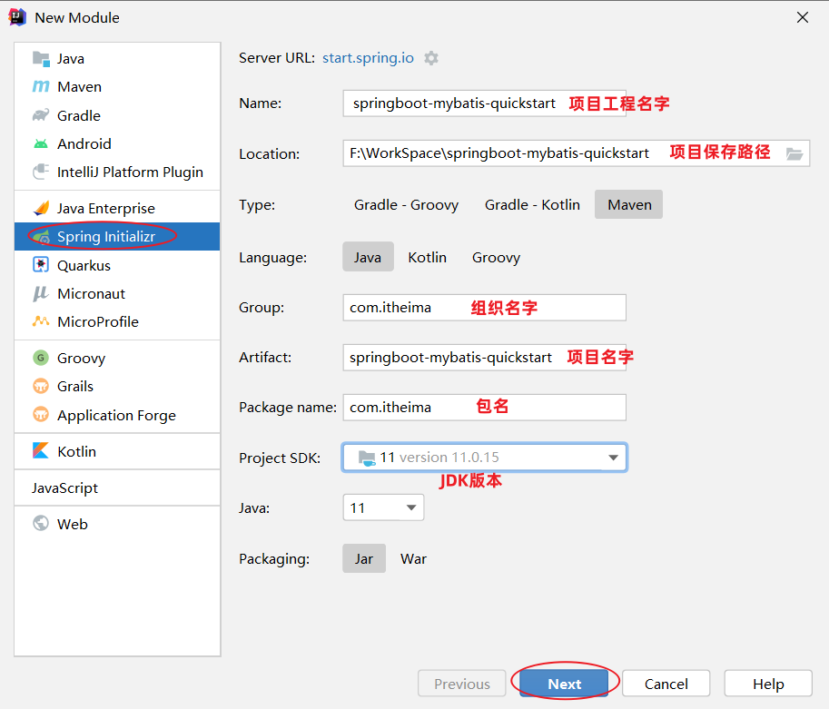
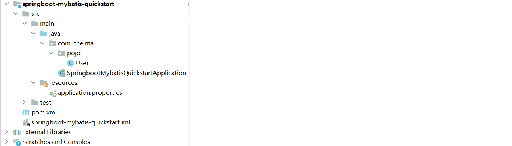

# Mybatis入门


## 前言

在前面我们学习MySQL数据库时，都是利用图形化客户端工具(如：idea、datagrip)，来操作数据库的。

> 在客户端工具中，编写增删改查的SQL语句，发给MySQL数据库管理系统，由数据库管理系统执行SQL语句并返回执行结果。
>
> 增删改操作：返回受影响行数
>
> 查询操作：返回结果集(查询的结果)

我们做为后端程序开发人员，通常会使用Java程序来完成对数据库的操作。Java程序操作数据库，现在主流的方式是：Mybatis。

什么是MyBatis?

- MyBatis是一款优秀的 **持久层** **框架**，用于简化JDBC的开发。

- MyBatis本是 Apache的一个开源项目iBatis，2010年这个项目由apache迁移到了google code，并且改名为MyBatis 。2013年11月迁移到Github。

- 官网：https://mybatis.org/mybatis-3/zh/index.html 

在上面我们提到了两个词：一个是持久层，另一个是框架。

- 持久层：指的是就是数据访问层(dao)，是用来操作数据库的。

 

- 框架：是一个半成品软件，是一套可重用的、通用的、软件基础代码模型。在框架的基础上进行软件开发更加高效、规范、通用、可拓展。


Mybatis课程安排：

- Mybatis入门

- Mybatis基础增删改查

- Mybatis动态SQL

接下来，我们就通过一个入门程序，让大家快速感受一下通过Mybatis如何来操作数据库。


## 1. 快速入门

需求：使用Mybatis查询所有用户数据。


### 1.1 入门程序分析

以前我们是在图形化客户端工具中编写SQL查询代码，发送给数据库执行，数据库执行后返回操作结果。

 


图形化工具会把数据库执行的查询结果，使用表格的形式展现出来

 


现在使用Mybatis操作数据库，就是在Mybatis中编写SQL查询代码，发送给数据库执行，数据库执行后返回结果。


 Mybatis会把数据库执行的查询结果，使用实体类封装起来（一行记录对应一个实体类对象）


Mybatis操作数据库的步骤：

1. 准备工作(创建springboot工程、数据库表user、实体类User)

2. 引入Mybatis的相关依赖，配置Mybatis(数据库连接信息)

3. 编写SQL语句(注解/XML)


### 1.2 入门程序实现

#### 1.2.1 准备工作

##### 1.2.1.1 创建springboot工程

创建springboot工程，并导入 mybatis的起步依赖、mysql的驱动包。




> 项目工程创建完成后，自动在pom.xml文件中，导入Mybatis依赖和MySQL驱动依赖

~~~xml
<!-- 仅供参考：只粘贴了pom.xml中部分内容 -->
<dependencies>
        <!-- mybatis起步依赖 -->
        <dependency>
            <groupId>org.mybatis.spring.boot</groupId>
            <artifactId>mybatis-spring-boot-starter</artifactId>
            <version>2.3.0</version>
        </dependency>

        <!-- mysql驱动包依赖 -->
        <dependency>
            <groupId>com.mysql</groupId>
            <artifactId>mysql-connector-j</artifactId>
            <scope>runtime</scope>
        </dependency>
        
        <!-- spring单元测试 (集成了junit) -->
        <dependency>
            <groupId>org.springframework.boot</groupId>
            <artifactId>spring-boot-starter-test</artifactId>
            <scope>test</scope>
        </dependency>
</dependencies>
~~~


##### 1.2.1.2 数据准备

创建用户表user，并创建对应的实体类User。

- 用户表：

```sql
-- 用户表
create table user(
    id int unsigned primary key auto_increment comment 'ID',
    name varchar(100) comment '姓名',
    age tinyint unsigned comment '年龄',
    gender tinyint unsigned comment '性别, 1:男, 2:女',
    phone varchar(11) comment '手机号'
) comment '用户表';

-- 测试数据
insert into user(id, name, age, gender, phone) VALUES (null,'白眉鹰王',55,'1','18800000000');
insert into user(id, name, age, gender, phone) VALUES (null,'金毛狮王',45,'1','18800000001');
insert into user(id, name, age, gender, phone) VALUES (null,'青翼蝠王',38,'1','18800000002');
insert into user(id, name, age, gender, phone) VALUES (null,'紫衫龙王',42,'2','18800000003');
insert into user(id, name, age, gender, phone) VALUES (null,'光明左使',37,'1','18800000004');
insert into user(id, name, age, gender, phone) VALUES (null,'光明右使',48,'1','18800000005');
```

 

- 实体类

  - 实体类的属性名与表中的字段名一一对应。

```java
public class User {
    private Integer id;   //id（主键）
    private String name;  //姓名
    private Short age;    //年龄
    private Short gender; //性别
    private String phone; //手机号
    
    //省略GET, SET方法
}
```




#### 1.2.2 配置Mybatis

> 在之前使用图形化客户端工具，连接MySQL数据库时，需要配置：
>
> 
>
> 连接数据库的四大参数：
>
> - MySQL驱动类 
> - 登录名
> - 密码
> - 数据库连接字符串

基于上述分析，在Mybatis中要连接数据库，同样也需要以上4个参数配置。

在springboot项目中，可以编写application.properties文件，配置数据库连接信息。我们要连接数据库，就需要配置数据库连接的基本信息，包括：driver-class-name、url 、username，password。

> 在入门程序中，大家可以直接这么配置，后面会介绍什么是驱动。


application.properties:

```properties
#驱动类名称
spring.datasource.driver-class-name=com.mysql.cj.jdbc.Driver
#数据库连接的url
spring.datasource.url=jdbc:mysql://localhost:3306/mybatis
#连接数据库的用户名
spring.datasource.username=root
#连接数据库的密码
spring.datasource.password=1234
```

> 上述的配置，可以直接复制过去，不要敲错了。 全部都是 spring.datasource.xxxx 开头。


#### 1.2.3 编写SQL语句

在创建出来的springboot工程中，在引导类所在包下，在创建一个包 mapper。在mapper包下创建一个接口 UserMapper ，这是一个持久层接口（Mybatis的持久层接口规范一般都叫 XxxMapper）。


UserMapper：

~~~java
import com.itheima.pojo.User;
import org.apache.ibatis.annotations.Mapper;
import org.apache.ibatis.annotations.Select;
import java.util.List;

@Mapper
public interface UserMapper {
    
    //查询所有用户数据
    @Select("select id, name, age, gender, phone from user")
    public List<User> list();
    
}
~~~

> @Mapper注解：表示是mybatis中的Mapper接口
>
> - 程序运行时：框架会自动生成接口的实现类对象(代理对象)，并给交Spring的IOC容器管理
>
>  @Select注解：代表的就是select查询，用于书写select查询语句


#### 1.2.4 单元测试

在创建出来的SpringBoot工程中，在src下的test目录下，已经自动帮我们创建好了测试类 ，并且在测试类上已经添加了注解 @SpringBootTest，代表该测试类已经与SpringBoot整合。 

该测试类在运行时，会自动通过引导类加载Spring的环境（IOC容器）。我们要测试那个bean对象，就可以直接通过@Autowired注解直接将其注入进行，然后就可以测试了。 

测试类代码如下： 

```java
@SpringBootTest
public class MybatisQuickstartApplicationTests {
	
    @Autowired
    private UserMapper userMapper;
	
    @Test
    public void testList(){
        List<User> userList = userMapper.list();
        for (User user : userList) {
            System.out.println(user);
        }
    }

}
```

> 运行结果：
>
> ~~~
> User{id=1, name='白眉鹰王', age=55, gender=1, phone='18800000000'}
> User{id=2, name='金毛狮王', age=45, gender=1, phone='18800000001'}
> User{id=3, name='青翼蝠王', age=38, gender=1, phone='18800000002'}
> User{id=4, name='紫衫龙王', age=42, gender=2, phone='18800000003'}
> User{id=5, name='光明左使', age=37, gender=1, phone='18800000004'}
> User{id=6, name='光明右使', age=48, gender=1, phone='18800000005'}
> ~~~


### 1.3 解决SQL警告与提示

默认我们在UserMapper接口上加的@Select注解中编写SQL语句是没有提示的。 如果想让idea给我们提示对应的SQL语句，我们需要在IDEA中配置与MySQL数据库的链接。 

默认我们在UserMapper接口上的@Select注解中编写SQL语句是没有提示的。如果想让idea给出提示，可以做如下配置：


配置完成之后，发现SQL语句中的关键字有提示了，但还存在不识别表名(列名)的情况：


> 产生原因：Idea和数据库没有建立连接，不识别表信息
>
> 解决方案：在Idea中配置MySQL数据库连接

 

> 在配置的时候指定连接那个数据库，如上图所示连接的就是mybatis数据库。


